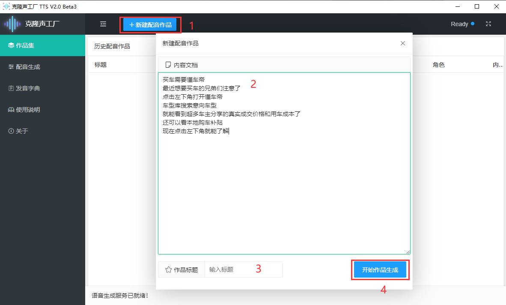
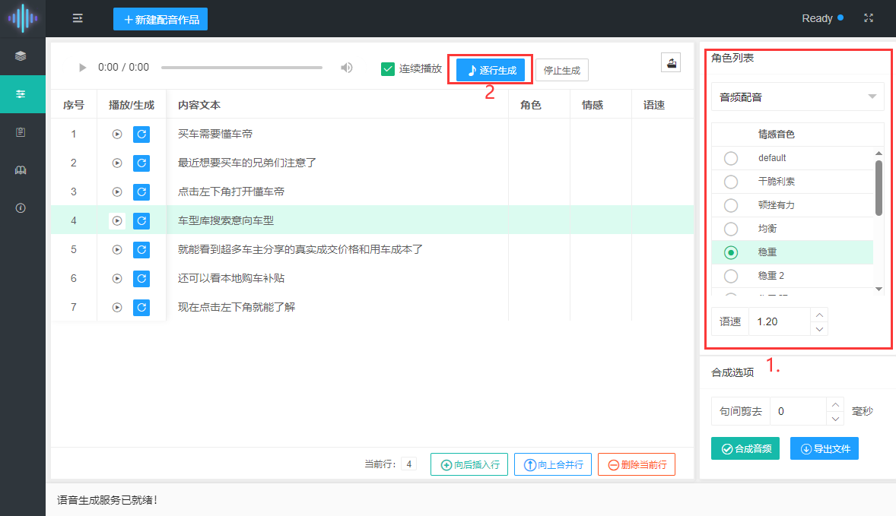
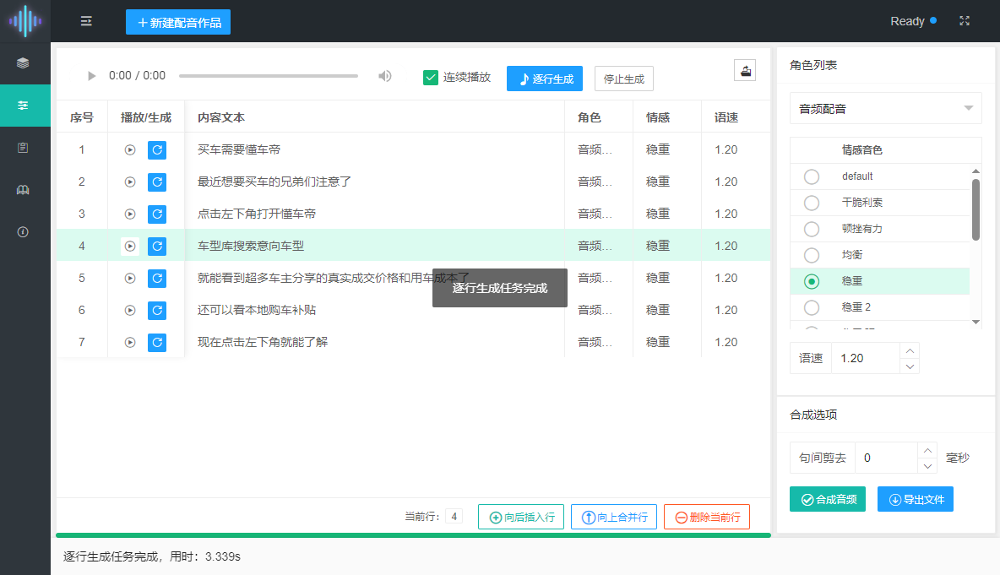
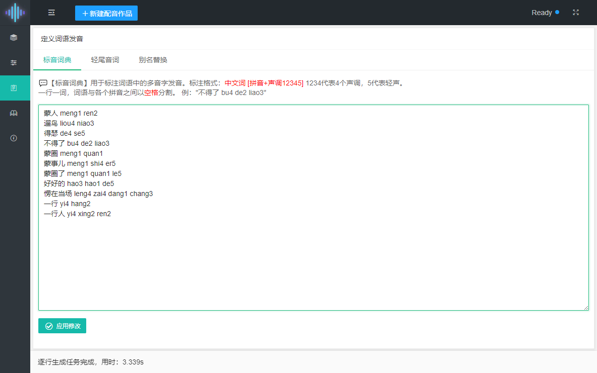
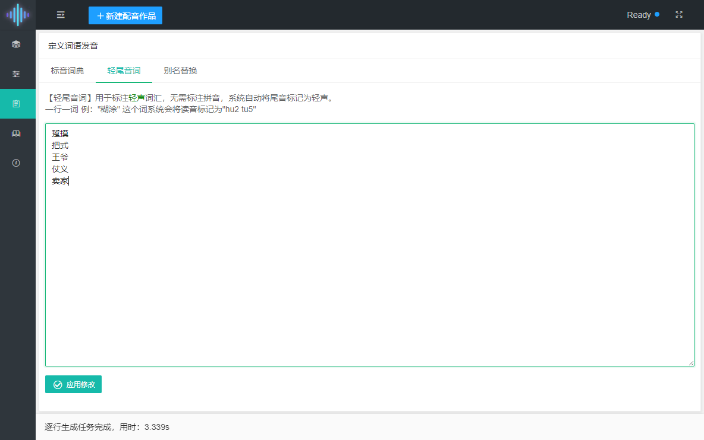
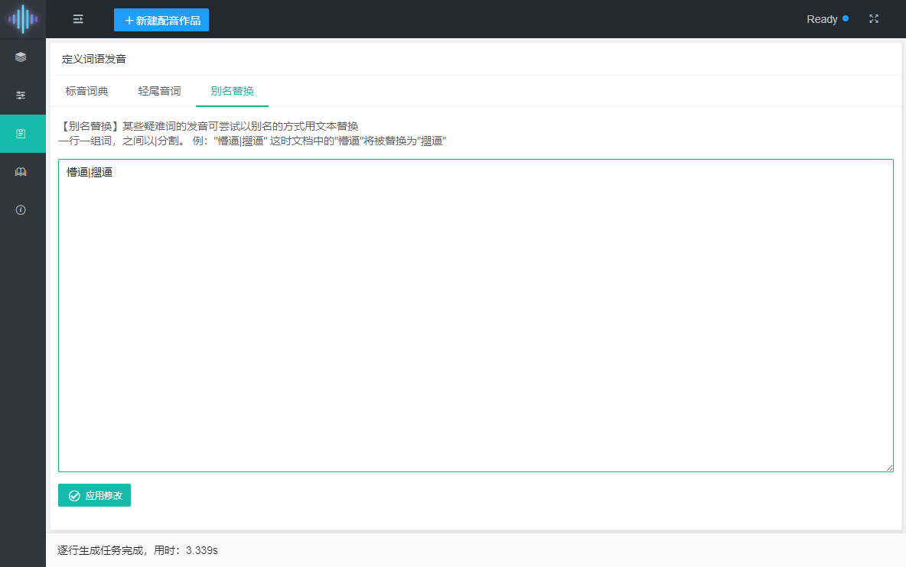

> 软件使用说明
#### 设备和硬件要求

* windows10 或以上操作系统
* CPU：4核或以上cpu均可
* 显卡：N卡 英伟达RTX 20系及以上  （1050TI上也可运行 但是慢）暂不支持AMD显卡 
* 内存：8G或以上 推荐16G

### 软件操作 配音生成步骤

#### 创建配音作品

- 首先点击`新建配音作品`按钮
- 将要生成怕配音的文案复制到`内容文档` 一行语句 单行不要太长
- 输入`作品标题` 如不输入则系统默认将第一行内容作为当前作品的标题
- 点击`开始作品生成`按钮 跳转到配音生成界面



#### 配音生成 逐行调优

- 在右侧`角色列表`选择一个配音员和`情感音色`
- 设置适当的`语速`
- 点击 `逐行生成` 按钮开始配音



- 逐行生产完成后 可点击行内的播放按钮进行试听
- 此时可以对单行配音进行调优 选择情感音或语速 对单行进行重新生成操作
- 如果对每一行的配音效果全都满意 则可以点击右侧的`合成音频`按钮 生成配音文件
- 合成完毕后就可以`导出文件` 将音频保存到本地

与其他配音软件相比本软件语气韵律更加丰富，每次生成可尝试选择不同的音色重复生成试听调优，可达到最佳的配音配音效果。

### 逐行调优技巧

#### 每行内容的长度

- 单行内容不宜过长，推荐在10-20字之内，一般为一句话。
- 也不宜过短，应尽量避免低于5字的单行内容，多了建议合并到上下行中。
- 使用`逗号`和`句号`断句，`问号`和`感叹号`加强情感。使生成的语音更生动自然。

#### 标点与停顿

- `逗号`的停顿稍短 `句号`稍长
- 如果想在语段话中加入更长的停顿，可考虑新起一行
- `空格`的停顿较长，但不建议使用，因为会丢失语气韵律衔接


### 多音字 发音校正

> 软件提供了三种方式对多音字和一些疑难词语的发音进行校正

#### 标音词典

**用于标注词语中的多音字发音**

标注格式：`中文词 [拼音+声调12345]` 1234代表4个声调，5代表轻声。

更多例子：
```js
蒙人 meng1 ren2
遛鸟 liou4 niao3
得瑟 de4 se5
不得了 bu4 de2 liao3
蒙圈 meng1 quan1
蒙事儿 meng1 shi4 er5
蒙圈了 meng1 quan1 le5
好好的 hao3 hao1 de5
愣在当场 leng4 zai4 dang1 chang3
一行 yi4 hang2
一行人 yi4 xing2 ren2
```
一行一词，词语与各个拼音之间以`空格`分割

#### 轻尾音词

**用于标注轻声词汇，无需标注拼音，系统自动将尾音标记为轻声。**

一行一词 比如："糊涂" 这个词系统会将读音标记为"hu2 tu5"

更多例子：
```js
踅摸
把式
王爷
仗义
卖家
```

#### 别名替换

**某些疑难词的发音可尝试以别名的方式用文本替换**

一行一组词，之间以|分割。 例："懵逼|擝逼" 这时文档中的"懵逼"将被替换为"擝逼"